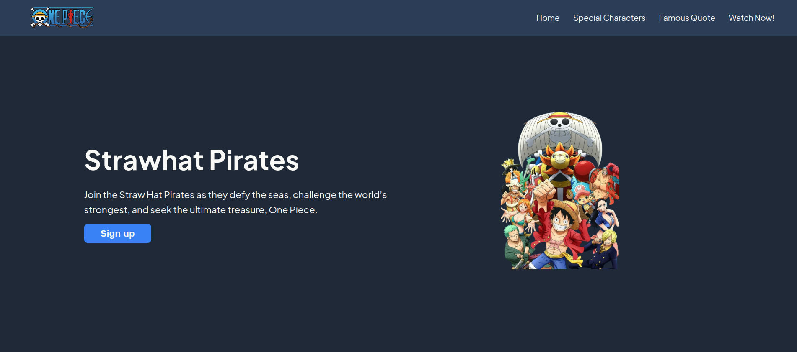

# Project: Landing Page

A landing page project built with basic HTML and CSS.

## Live Demo

https://dan-wn.github.io/odin-landing-page/

## 📸 Preview


## 🧠 Problem Statement

I wanted to build a solid foundational knowledge on CSS before using any frameworks.

## ✨ Features

- Partially Responsive layout
- Semantic HTML structure
- CSS Flexbox
- Accessible navigation

## 🛠 Tech Stack

- HTML5
- CSS3

## 📦 Tools

- VS Code
- Git & GitHub
- Chrome DevTools

## 🚧 Challenges & Learnings

- Struggled with consistent spacing across breakpoints
- Improved understanding of flexbox

## 🚀 Future Improvements

- Make fully responsive websites
- Improve overall code structure
- Prevent unnecessary repetition on styling
- Know when to use what

## ▶️ Running Locally

1. Clone the repository
   ```bash
   git clone https://github.com/dan-wn/odin-landing-page.git

## 🙏 Credits

- Project from theodinproject.com